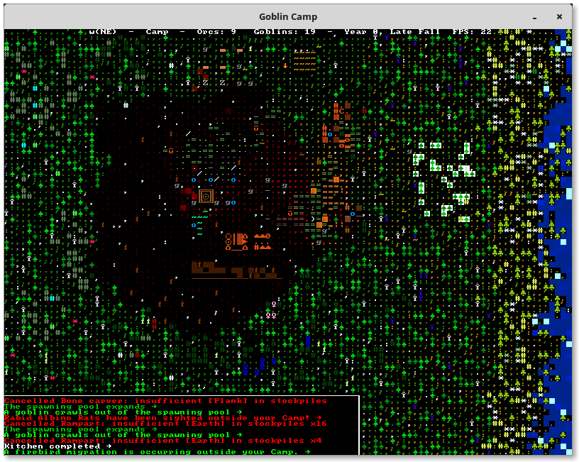
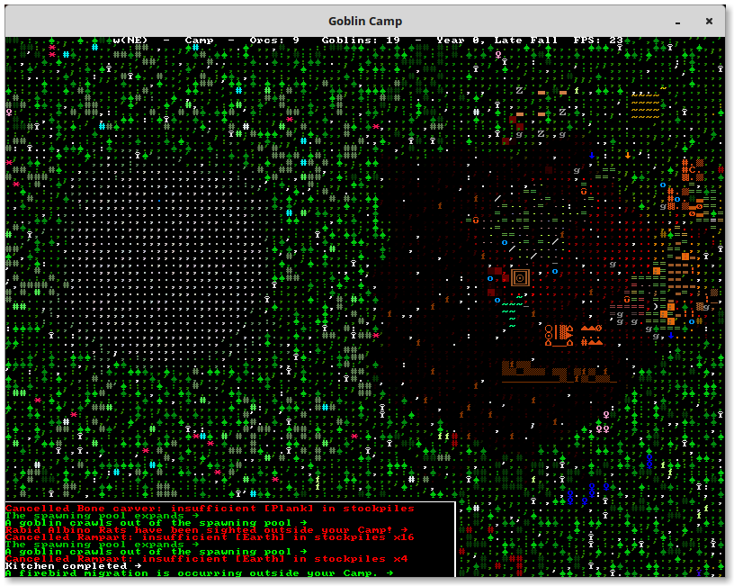
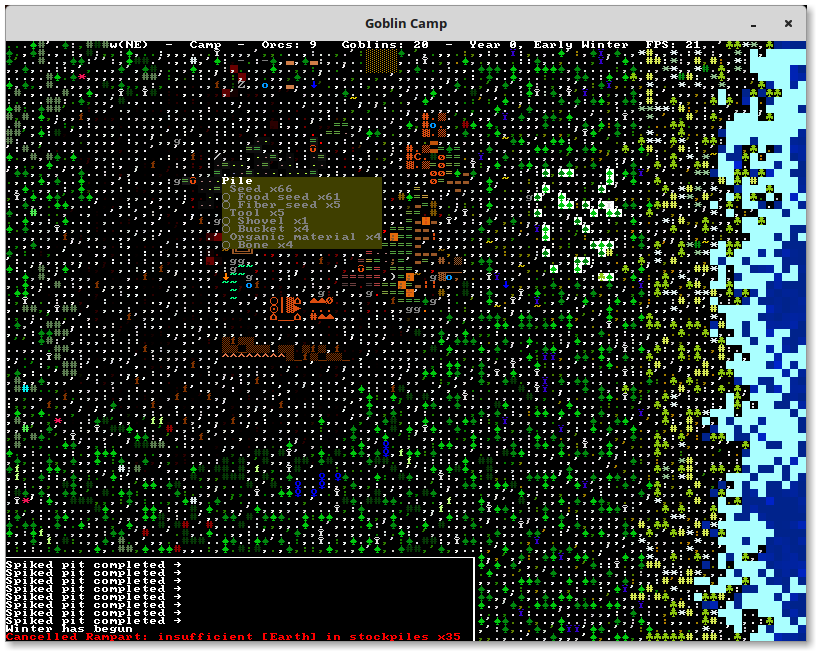

Goblins camp is Dwarf Fortress-like game.

The code have been abandoned some years ago, but you can still build and run it in in Debian Wheezy
chroot container. See [BUILD.using_cmake.md](BUILD.using_cmake.md) for building guide

    
    
    
    

