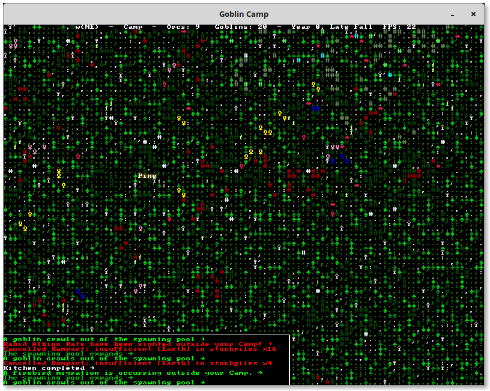

## About

Goblin Camp aims to be a roguelike city builder with an emphasis on
macromanaging the economy and military. I've drawn inspiration from games
such as Anno 1404, Dwarf Fortress and Dungeon Keeper.

Goblins camp is Dwarf Fortress-like game.

### Status Quo

The code have been abandoned some years ago, but you can still build and run it in in Debian Wheezy chroot container.
See [BUILD.using_cmake.md](BUILD.using_cmake.md) for building guide

<p align="center">
    
    
    
    
</p>

### Modern CMake

Simplify the process of build the app.

```sh
mkdir Build && cd Build
wget -O boost-libraries.tar.gz https://dl.bintray.com/boostorg/release/1.71.0/source/boost_1_71_0.tar.gz
tar xzvf boost-libraries.tar.gz
cd boost_1_71_0/
./bootstrap.sh
./b2
sudo ./b2 install
sudo apt-get install libsdl1.2-dev
sudo apt-get install libsdl-image1.2-dev
cmake ..
make
```